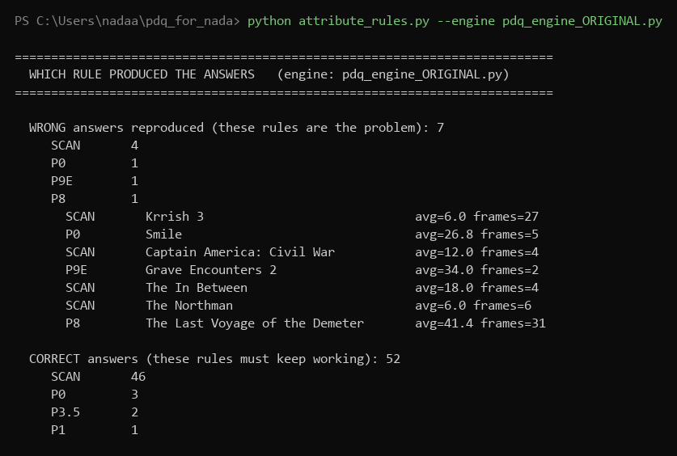
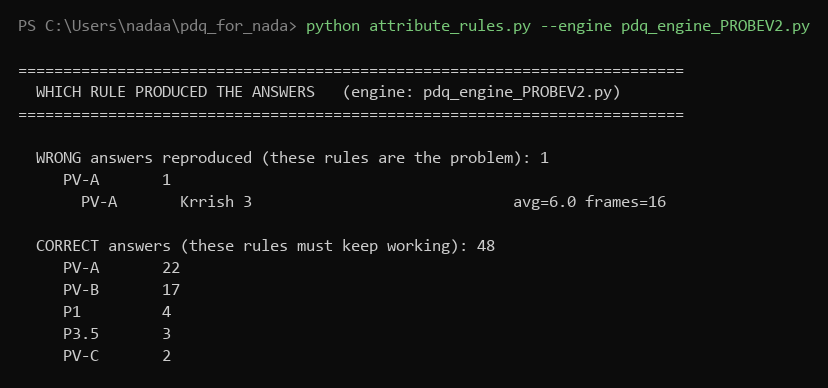
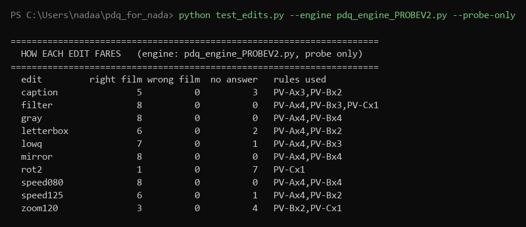
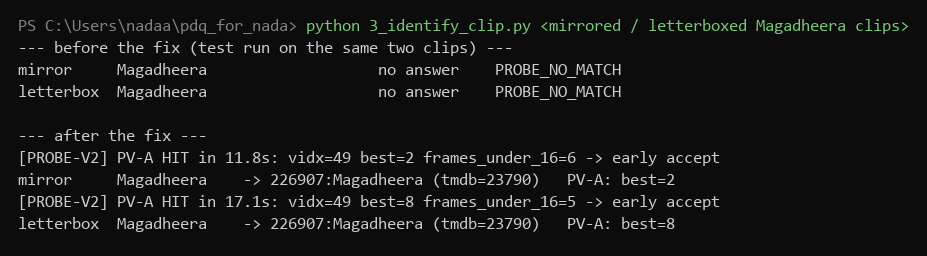
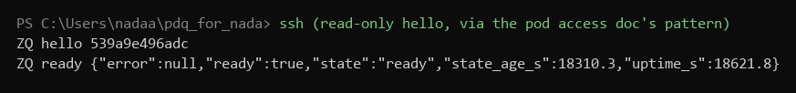

# Changing the tech, not the thresholds

*What the system has that the probe didn't, the probe rebuilt from those pieces, and what
it does to the wrong answers. Plus: the edits test, and two holes fixed.*

Nada. For the meeting on 4 October 2026.

## The week in short

| | |
|---|---|
| Wrong answers, pod's rules | 7 |
| Wrong answers, new probe + rules | **1** |
| Correct answers kept | 48 of 52 |
| Mirrored clips identified | 0 of 8 before, **8 of 8** now |
| Letterboxed clips identified | 1 of 8 before, **6 of 8** now |

- Last week's advice was to change the tech rather than keep bending the rule thresholds.
  So I compared the three parts of the engine that can answer, found what the careful part
  has that the deciding parts don't, and rebuilt the probe from the missing pieces.
- Every test now names the rule behind every answer, so a wrong answer can never appear
  in my numbers again without the rule that made it standing next to it.
- I also tested ten kinds of creator edit against the engine, found two where it goes
  completely blind, and fixed both without moving a single number on the real clips.

## 1. First: which rule actually gave the wrong answers

I ran all 125 testable clips through the pod's rules and recorded which part of the engine
produced each answer. This is the full attribution, not a sample:

Two things fall out of this picture.

- **The pre-scan is behind 4 of the 7 wrong answers**, at distances 6 to 18. Those are
  genuinely identical pictures. The rules never ran on them, which is why two weeks of
  rule changes could never have touched them.
- The other three (P0, P9E, P8) are exactly the rules my earlier changes went after.

## 2. What the system has that the deciders don't

The engine has three parts that can answer: the pre-scan, the probe (P0), and the rules.
The odd thing is how unevenly they are equipped:

| check | pre-scan | probe P0 | the careful rules (P4, P6a, P7) |
|---|---|---|---|
| sees the whole clip | yes | no, first 4 seconds | yes |
| needs more than one frame | 3 | **1** | 5 to 30 |
| hits must agree where in the film they land | **no** | **no** | yes |
| hits from more than one moment of the clip | **no** | **no** | some |

The engine's own notes say a true match gives the same film-time offset for every matched
frame. That is the strongest structural signal in the data, and the two parts that decide
almost everything ignore it completely. The pre-scan decides with the probe's confidence
and none of the rules' checking.

## 3. The probe, rebuilt from the missing pieces

`pdq_engine_PROBEV2.py`. It keeps the pre-scan's whole-clip view (40 sampled frames) and
adds everything in that table: all crop families, a mini scorecard per film, the
film-time agreement check, the clip-spread check. Its three accept bars each copy a rule
the pod already trusts:

| bar | fires on | copied from |
|---|---|---|
| PV-A | two near-perfect frames | P2.5 |
| PV-B | the old pre-scan bar, plus two hits agreeing on film time | pre-scan + P4 |
| PV-C | five medium frames, agreeing, from two moments of the clip | P6a |

The old one-frame P0 is retired in this version; the probe replaces it.

## 4. The measurement

| engine | wrong answers | correct answers |
|---|---|---|
| the pod's rules | 7 | 52 |
| the new probe alone, nothing else running | 1 | 41 |
| **the new probe, rules as the fallback** | **1** | **48** |

- Six of the seven wrong answers are gone. The survivor is Krrish 3 at distance 6: the
  pictures really are in the index, so nothing picture-based can refuse it. It belongs
  with audio and SSCD, with its scorecard.
- The four lost correct answers are all montage clips: the right film was the probe's top
  hint every time, but the hits scatter across film time because the clip cuts between
  scenes, and then the streaming pass gives up before reaching the matching stretch.
  I can recover them, but the same loosening lets The Northman and Civil War back in,
  because on picture evidence those wrong answers look exactly like these right ones.
  On "a no answer beats a wrong one" I left them out. That is a policy call, and I would
  like it confirmed rather than mine.
- One oddity from the full tables: the clip the pod answered as The Misfits is answered
  as F1: The Movie by both the pod's rules and mine, at distance 8. Worth watching that
  clip; the live answer may have come from a different detective than we think.

## 5. The edits test

Ten edits a reposter actually makes, each applied to 8 clips the engine identifies
correctly unedited. So when an edited copy fails, the edit is the only reason. First
finding: **no edit ever produced a wrong film, on any engine version. Edits only make
the engine go silent.**

Filters, black and white, recompression and speed changes barely scratch it. Rotation
and zoom degrade it. Two edits blinded it completely: mirroring (0 of 8) and letterboxing
(1 of 8). Both turned out to be missing-tech, not thresholds:

- **Mirror**: nothing in the engine ever hashes a flipped frame. The probe now hashes the
  mirror of every view it samples. Mirrored clips: 0 of 8 to 8 of 8, matching at
  distance 2.
- **Letterbox**: the pod has an "active region crop" that finds the picture inside the
  black bars, and it is one of the pieces the laptop port left out. I built a simple
  version into the probe. Letterboxed clips: 1 of 8 to 6 of 8. The two still missed have
  bars that are not quite black after recompression.

The safety gate: I re-ran all 125 real clips with the new views switched on. **Not one
answer changed.** The extra views only ever add, never subtract.

The honest cost: the extra views make the probe about four times slower per clip. On my
laptop that is irrelevant. If this ever goes near the pod, the sensible shape is plain
views first and the mirror and bar-trim views only when the plain views found nothing,
so ordinary clips cost what they cost today.

## 6. Housekeeping

- Everything is in a private GitHub repo now, `pdq-testing`, with the full history and
  all the result CSVs. Happy to add you to it.
- Pod access works end to end from my machine. Verified read-only, nothing touched:

- While setting that up, the access doc with the key in it ended up pasted into a chat.
  If you would rather rotate the key, now is a clean moment.

## 7. What I would like from the meeting

1. The policy call on the four montage clips: keep the strict trade, or recover them and
   accept Northman and Civil War back. I recommend keeping the strict trade.
2. A look at the Misfits clip that both engines call F1: The Movie.
3. A direction: is the rebuilt probe something you want taken towards the pod, as a
   replacement for the pre-scan and P0? If yes, I would start with the plain-views-first
   version and measure it on the pod's index size.
4. Still open from last week: retention on clip_query_hashes for voted clips. The clip
   rot has not stopped being true.

---

Everything here ran on my laptop against the 134-film index with 16.7 million
fingerprints. The full write-up with every table is PROBE_VS_SYSTEM.md; the three
commands that reproduce all of it are attribute_rules.py, make_edited_clips.py and
test_edits.py. The screenshots are the real printouts of those runs.
